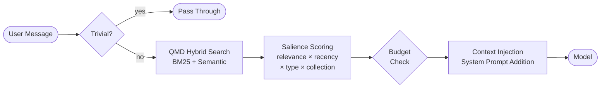

<div align="center">
  

  <h1>LUCID</h1>
  <h3>Autonomous memory retrieval for OpenClaw agents</h3>

  <p>
    <a href="#install"></a>
    <a href="LICENSE"></a>
    <a href="https://github.com/openclaw/openclaw"></a>
  </p>

  <p><em>Hooks into OpenClaw's native ContextEngine API — your agent searches its knowledge base before the model ever sees your message.</em></p>
</div>

---

## The Problem

Standalone scoring libraries compute relevance — but you still have to wire up every part of the retrieval pipeline yourself on every message. That's plumbing no one should write twice.

LUCID handles the full pipeline. Install once. It runs automatically on every turn.

---

## How LUCID Works

Every time you send a message, LUCID:

1. **Filters trivially** — skips search on "ok", "thanks", heartbeats, and short acks
2. **Searches your workspace** — hybrid BM25 + semantic search via QMD
3. **Scores by salience** — not just relevance, but recency, file type, and collection priority
4. **Respects your budget** — injects only what fits in your remaining context window
5. **Passes it through** — the model sees recalled context as part of its system prompt, automatically

No prompt changes. No tool calls. No manual retrieval. It just works.

---

## Architecture



### Salience Formula

```
salience = qmd_score × recency_weight × type_weight × collection_weight
```

| Factor | Values |
|--------|--------|
| **Recency** | ≤7d: `1.5×` · ≤30d: `1.2×` · ≤90d: `1.0×` · older: `0.8×` |
| **Type** | `LESSONS.md`: `2.0×` · `decision`: `1.5×` · `memory/*`: `1.0×` · `log`: `0.7×` |
| **Collection** | `memory`: `1.5×` · `codex`: `1.2×` · default: `1.0×` |

---

## Features

| | |
|---|---|
| 🔍 **Hybrid Search** | BM25 + semantic via QMD — finds exact matches and conceptual matches |
| 🎯 **Salience Scoring** | Recency, file type, and collection priority all factor in |
| 💰 **Budget Aware** | Respects your context window — injects top-K up to remaining tokens |
| ⚡ **Trivial Filtering** | Short acks and heartbeats skip search entirely |
| 🔄 **Cross-Collection** | Reads from any QMD-indexed collection in your workspace |
| 🛡️ **Graceful Fallback** | QMD unavailable? Silent passthrough — no errors, no interruptions |
| 🔧 **Zero Config** | Auto-detects QMD path, sensible defaults out of the box |

---

## Install

```bash
git clone https://github.com/Spaztazim/lucid-context-engine.git ~/.openclaw/extensions/lucid-context-engine
```

Then activate in your OpenClaw config (`~/.openclaw/config.json` or per-agent):

```json
{
  "plugins": {
    "slots": {
      "contextEngine": "lucid"
    },
    "entries": {
      "lucid-context-engine": {
        "enabled": true
      }
    }
  }
}
```

Restart your agent. Done.

---

## Configuration

All options are optional — defaults work out of the box.

```json
{
  "plugins": {
    "entries": {
      "lucid-context-engine": {
        "enabled": true,

        // Max results to inject per turn
        "topK": 5,

        // Minimum salience score (0.0–1.0) to include a result
        "threshold": 0.3,

        // Path to qmd-shim.js (auto-detected if omitted)
        "qmdShimPath": "~/clawd/tools/qmd-shim.js",

        // Max milliseconds to wait for QMD before falling back
        "timeoutMs": 5000
      }
    }
  }
}
```

| Option | Default | Description |
|--------|---------|-------------|
| `topK` | `5` | Max results injected per turn |
| `threshold` | `0.3` | Minimum salience score to include |
| `qmdShimPath` | auto | Path to `qmd-shim.js` |
| `timeoutMs` | `5000` | QMD timeout in milliseconds |

---

## Comparison

| | LUCID | Standalone Scoring Library |
|---|---|---|
| Full retrieval pipeline | ✅ | ❌ Manual wiring required |
| Automatic on every turn | ✅ | ❌ Must call per-message |
| Context budget management | ✅ | ❌ |
| Trivial prompt filtering | ✅ | ❌ |
| Graceful fallback | ✅ | ❌ |
| OpenClaw native integration | ✅ | ❌ |
| Lines of setup code | ~5 | ~100+ |

---

## Requirements

- **OpenClaw** v3.7+
- **QMD** workspace search daemon (ships with OpenClaw)
- **Node.js** 18+

---

## Building from Source

```bash
npm install
npm run build
```

Output goes to `dist/`.

---

## Built By

<div align="center">
  <p>
    <strong>Almost Spec Labs</strong><br>
    <a href="https://github.com/Spaztazim">github.com/Spaztazim</a>
  </p>
</div>

---

<div align="center">
  <sub>MIT License · 2026 Almost Spec Labs</sub>
</div>
